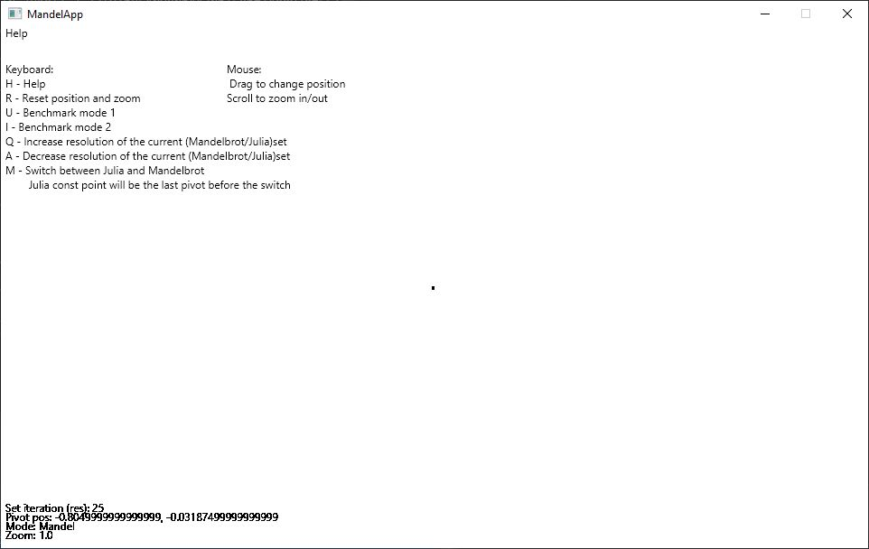
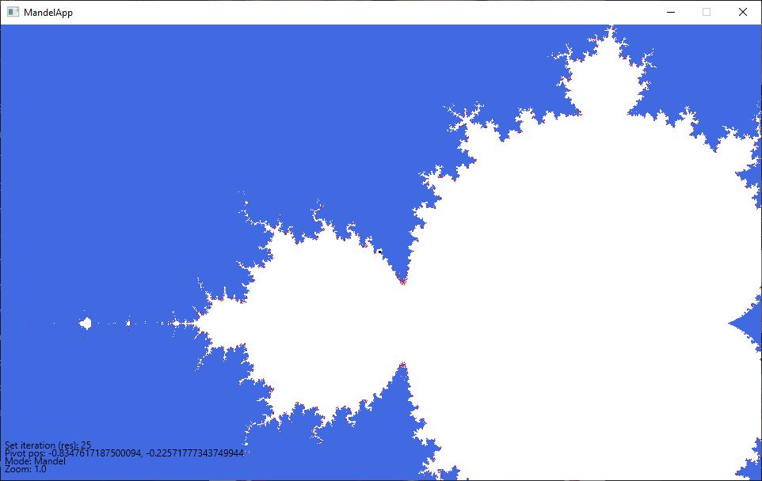
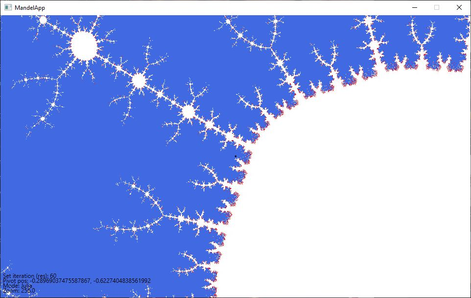

# Multithreaded Mandelbrot and Julia set viewer
This project is a simple interactive Mandelbrot and Julia set viewer for Kotlin-based Software Development course as homework.

## Main features:
- Scalable CPU based rendering using Kotlin coroutines and channels
- Scalable chunck-based rendering
- Mandelbrot and Julia set viewport switching 
- Iteration change realtime
- Configurable via launch parameters. (window size, number of worker threads, rendered chunk size)
- Benchmark mode

## Use the software
By default the program starts in a 960x576 sized window, reserve 16 threads and divides the window to 96x96 chunks.

First can see the help screen, after the first mouse drag starts the mandelbrot set rendering.

Pressing the mode switch ('M' button) can change the rendered set. Note that the julia set will be rendered from the last center coordinates of the viewed Mandelbrot set. 

## Dependency 
- Kotlin coroutines (imported via Gradle)